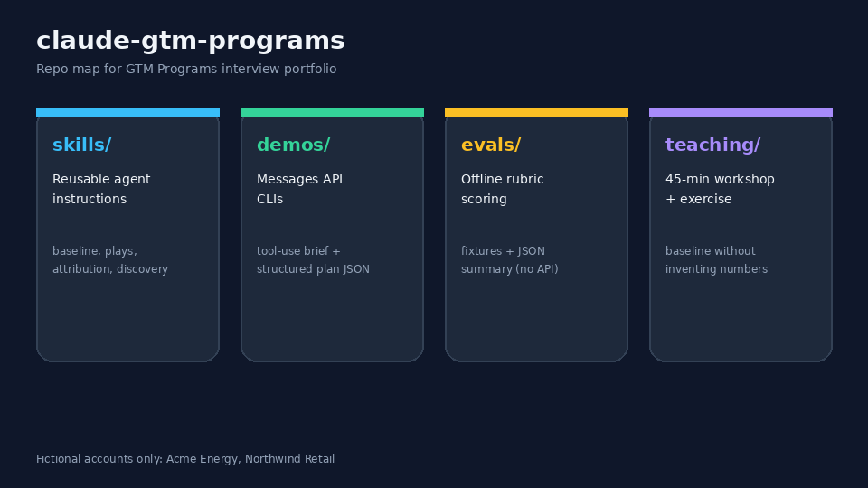
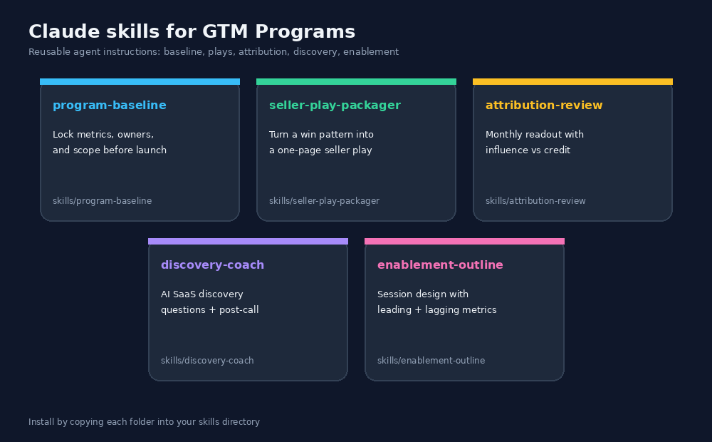
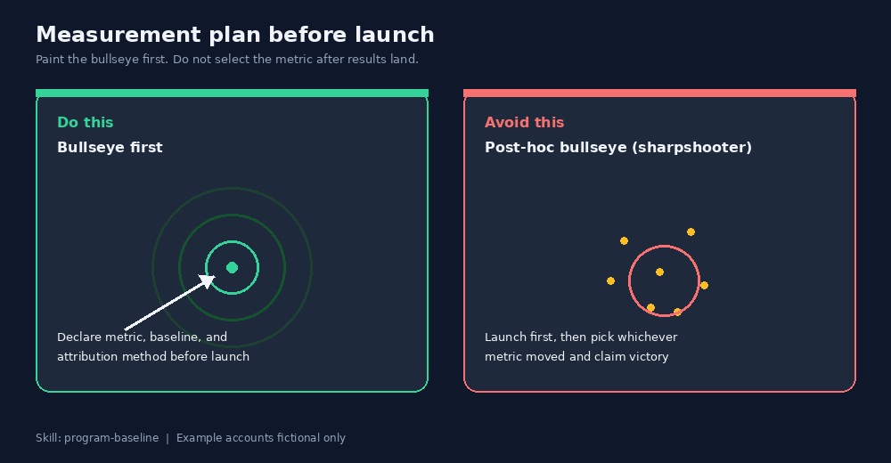
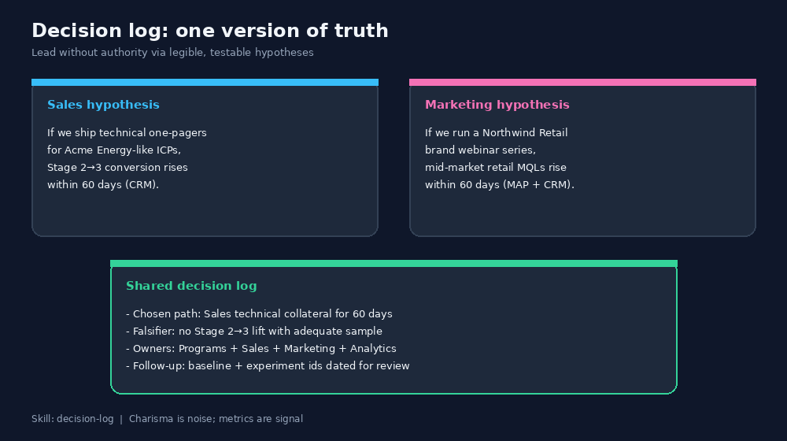
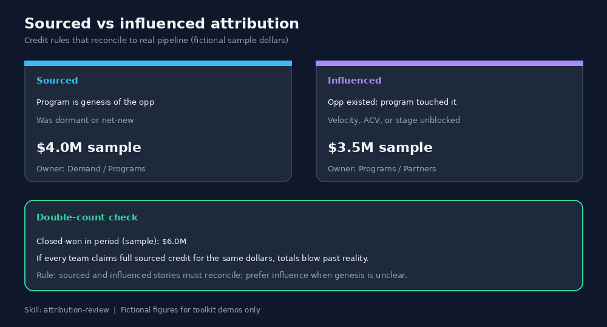
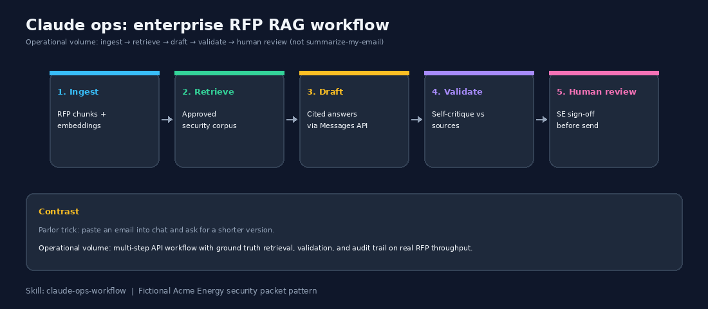
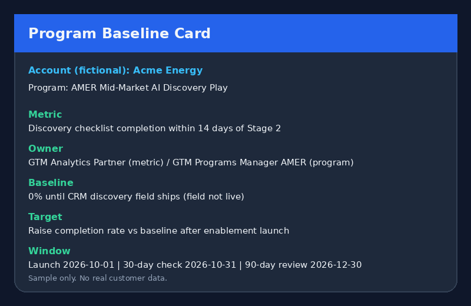
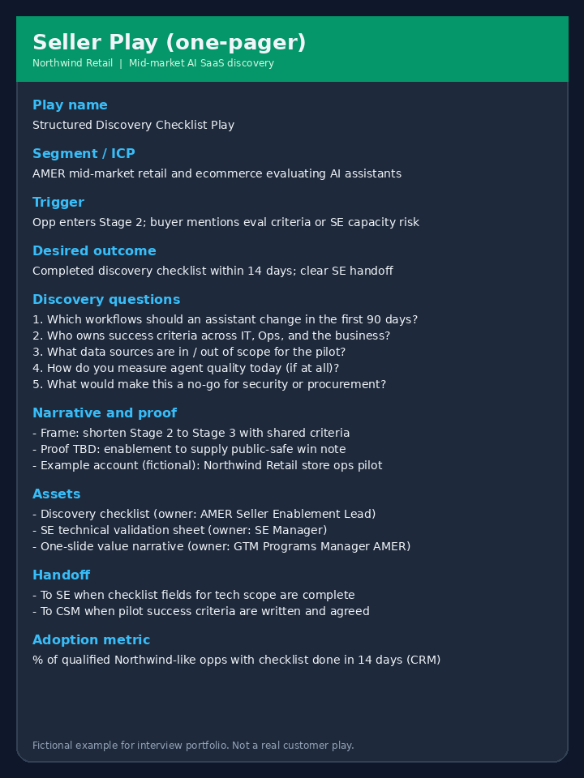
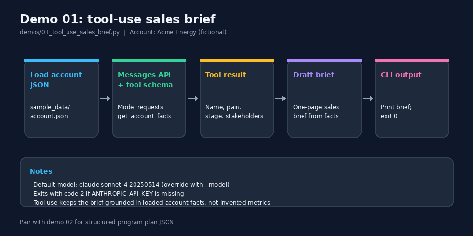

# claude-gtm-programs

Public toolkit and reference for **Claude skills** applied to **GTM Programs** work.

This repo shows how Claude skills, small demos, offline evals, and a short workshop fit real GTM Programs themes: baselines before launch, packaging wins into seller plays, attribution reviews, AI SaaS discovery coaching, measured enablement, decision logs, field experiments, operating cadence instrumentation, and operational Claude workflows.

Author: **Albert Chan**  
LinkedIn: [linkedin.com/in/albe88](https://www.linkedin.com/in/albe88)

Fictional accounts only: **Acme Energy**, **Northwind Retail**. No real customer secrets.

## What this toolkit encodes

Empirical GTM methods you can inspect as skills, demos, and visuals:

1. **Empirical loop** - observe → hypothesis → experiment → measure → package play
2. **Measurement before launch** - baseline, targets, attribution method; no post-hoc bullseye
3. **Control groups and staged rollouts** - isolate causal uplift from seasonality and luck
4. **Decision log** - one version of truth; competing hypotheses with falsifiers; lead via legibility
5. **Seller plays without you** - package wins so AEs/SEs run the motion from assets and CRM fields
6. **Operating cadence** - surface program metrics in existing CRM/BI reviews, not slide-deck theater
7. **Sourced vs influenced** - attribution that reconciles without double counting
8. **Claude at operational volume** - ingest → retrieve → draft → validate → human review (RFP RAG pattern), not email polish

## What's inside

| Folder | Maps to GTM Programs work |
|--------|---------------------------|
| `skills/` | Reusable agent instructions for baseline, plays, attribution, discovery, enablement, decision logs, experiments, cadence, Claude ops |
| `paste-into-claude/` | One-paste Instant demos for Claude.ai (start with 01-decision-log) |
| `demos/` | Messages API demos plus offline decision-log builder; sample JSON for experiments |
| `evals/` | Offline rubric scoring for program plans (no API) |
| `teaching/` | 45-minute workshop, baseline exercise, control-group rollout exercise |

**Default demo model:** `claude-sonnet-4-20250514` (override with `--model`).


## Visual examples

Screenshots for a quick look without running code. Regenerate with `python scripts/generate_visuals.py` (needs `pillow`).



*Repo map: skills, demos, evals, and teaching folders.*



*Skills grid: baseline, plays, attribution, discovery, enablement, decision-log, experiment-design, operating-cadence, claude-ops-workflow.*


*Empirical GTM loop: observe → hypothesis → experiment → measure → package play.*



*Paint the bullseye first vs post-hoc metric selection (sharpshooter pattern).*


*Control vs treatment staged rollout (fictional Acme Energy playbook).*



*Decision log as one version of truth across Sales and Marketing hypotheses.*



*Sourced vs influenced attribution with a double-count check.*



*Operational Claude RFP workflow: ingest → retrieve → draft → validate → human review.*



*Sample program baseline card (Acme Energy, fictional).*



*One-page seller play mock (Northwind Retail, fictional).*


*Discovery coach flow: context through post-call capture.*


*Mock monthly attribution review with influence vs credit.*


*Offline eval summary from `python evals/harness.py`.*


*Sample structured program plan JSON (from fixtures).*


*45-minute workshop agenda timeline.*



*Demo 01 tool-use flow: load account, call tool, draft brief.*


## Try this in 60 seconds

No install required. Works in [Claude.ai](https://claude.ai).

1. Open [`paste-into-claude/01-decision-log.md`](https://github.com/victorvictory88/claude-gtm-programs/blob/master/paste-into-claude/01-decision-log.md) (start with 01).
2. Select all, copy, paste into a new Claude.ai chat.
3. Watch the demo output appear. No second prompt needed.

Each paste file tells Claude to run the Instant demo scenario immediately with fictional Acme Energy or Northwind Retail data.

| Start with | Paste file | Skill |
|------------|------------|-------|
| 01 | [`paste-into-claude/01-decision-log.md`](https://github.com/victorvictory88/claude-gtm-programs/blob/master/paste-into-claude/01-decision-log.md) | decision-log |
| 02 | [`paste-into-claude/02-program-baseline.md`](https://github.com/victorvictory88/claude-gtm-programs/blob/master/paste-into-claude/02-program-baseline.md) | program-baseline |
| 03 | [`paste-into-claude/03-experiment-design.md`](https://github.com/victorvictory88/claude-gtm-programs/blob/master/paste-into-claude/03-experiment-design.md) | experiment-design |
| 04 | [`paste-into-claude/04-seller-play-packager.md`](https://github.com/victorvictory88/claude-gtm-programs/blob/master/paste-into-claude/04-seller-play-packager.md) | seller-play-packager |
| 05 | [`paste-into-claude/05-claude-ops-workflow.md`](https://github.com/victorvictory88/claude-gtm-programs/blob/master/paste-into-claude/05-claude-ops-workflow.md) | claude-ops-workflow |
| 06 | [`paste-into-claude/06-attribution-review.md`](https://github.com/victorvictory88/claude-gtm-programs/blob/master/paste-into-claude/06-attribution-review.md) | attribution-review |
| 07 | [`paste-into-claude/07-discovery-coach.md`](https://github.com/victorvictory88/claude-gtm-programs/blob/master/paste-into-claude/07-discovery-coach.md) | discovery-coach |
| 08 | [`paste-into-claude/08-enablement-outline.md`](https://github.com/victorvictory88/claude-gtm-programs/blob/master/paste-into-claude/08-enablement-outline.md) | enablement-outline |
| 09 | [`paste-into-claude/09-operating-cadence.md`](https://github.com/victorvictory88/claude-gtm-programs/blob/master/paste-into-claude/09-operating-cadence.md) | operating-cadence |

Optional: clone the repo and use Quickstart below for demos and evals (`evals/harness.py` needs no API key).

## Quickstart

```bash
cd claude-gtm-programs
python3 -m venv .venv
source .venv/bin/activate   # Windows: .venv\Scripts\activate
pip install -r requirements.txt
cp .env.example .env        # then set ANTHROPIC_API_KEY
export ANTHROPIC_API_KEY=sk-ant-...

# Demos (exit code 2 if key missing for 01/02)
python demos/01_tool_use_sales_brief.py
python demos/02_structured_program_plan.py --pretty
python demos/03_decision_log_builder.py   # offline; no API key

# Offline evals (no API key)
python evals/harness.py
```

## Install skills (Claude / Cursor)

Copy each skill folder into your skills directory so the agent can load `SKILL.md`:

```bash
# Example: Claude Code / Cursor skills location may vary by setup
cp -R skills/program-baseline <YOUR_SKILLS_DIR>/program-baseline
cp -R skills/seller-play-packager <YOUR_SKILLS_DIR>/seller-play-packager
cp -R skills/attribution-review <YOUR_SKILLS_DIR>/attribution-review
cp -R skills/discovery-coach <YOUR_SKILLS_DIR>/discovery-coach
cp -R skills/enablement-outline <YOUR_SKILLS_DIR>/enablement-outline
cp -R skills/decision-log <YOUR_SKILLS_DIR>/decision-log
cp -R skills/experiment-design <YOUR_SKILLS_DIR>/experiment-design
cp -R skills/operating-cadence <YOUR_SKILLS_DIR>/operating-cadence
cp -R skills/claude-ops-workflow <YOUR_SKILLS_DIR>/claude-ops-workflow
```

Each `SKILL.md` has YAML frontmatter (`name`, `description` starting with "use this when…") plus actionable instructions.

### Skills at a glance

- **program-baseline** - measurement plan and metrics locked before launch
- **seller-play-packager** - turn a win pattern into a one-page play sellers run without you
- **attribution-review** - monthly/quarterly readout; sourced vs influenced without double counting
- **discovery-coach** - AI SaaS discovery questions and post-call capture
- **enablement-outline** - session design with leading and lagging adoption metrics
- **decision-log** - one version of truth; competing hypotheses with falsifiers
- **experiment-design** - baseline, hypothesis, control vs treatment, staged rollout
- **operating-cadence** - instrument program metrics into existing CRM/BI reviews
- **claude-ops-workflow** - operational-volume Claude/API workflows (RFP RAG pattern)

## Demos

See `demos/README.md`. CLIs 01-02 use `argparse` and the Anthropic Python SDK Messages API. Demo 03 builds a decision log offline from sample JSON.

## Evals

See `evals/README.md`. `harness.py` loads fixtures, scores baseline clarity / measurable metrics / named owners / no fluff, and prints a JSON summary.

## Teaching

See `teaching/README.md`. Workshop length: 45 minutes. Exercises: set a program baseline; design a control-group staged rollout (Acme Energy, fictional).

## License

MIT License. Copyright (c) 2026 Albert Chan.
