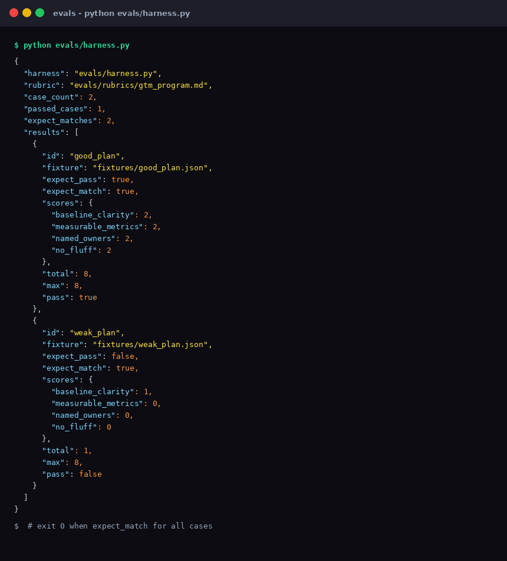
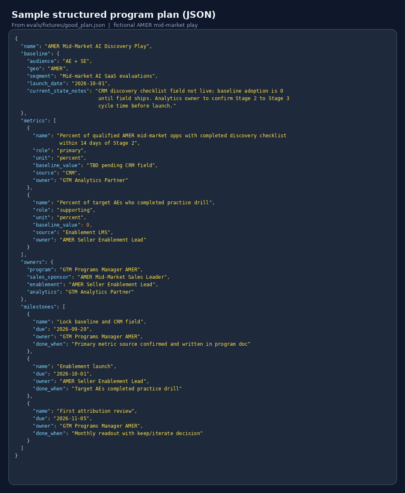
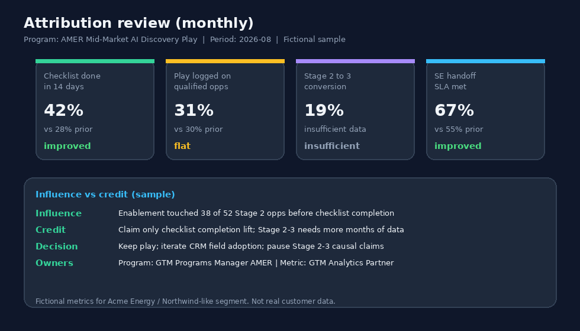

# Evals

Offline evaluation for structured GTM program plans. No API key required.

## What it checks

Rubric dimensions (see `rubrics/gtm_program.md`):

- baseline clarity
- measurable metrics
- named owners
- no fluff

Fixtures:

- `fixtures/good_plan.json` - should pass
- `fixtures/weak_plan.json` - should fail

## Run

```bash
python evals/harness.py
```

Prints a JSON summary with per-case scores. Exit code `1` if a case does not match its `expect_pass` flag.

## Visual examples



*Terminal-style view of the JSON summary from `python evals/harness.py`.*



*Fixture-shaped program plan used by the offline evals.*



*Related monthly readout shape (skill theme; not scored by the harness).*
