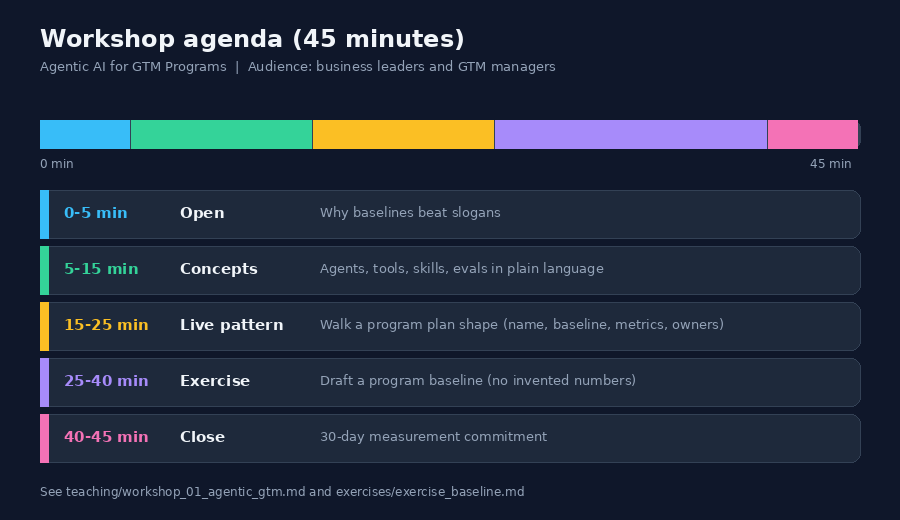
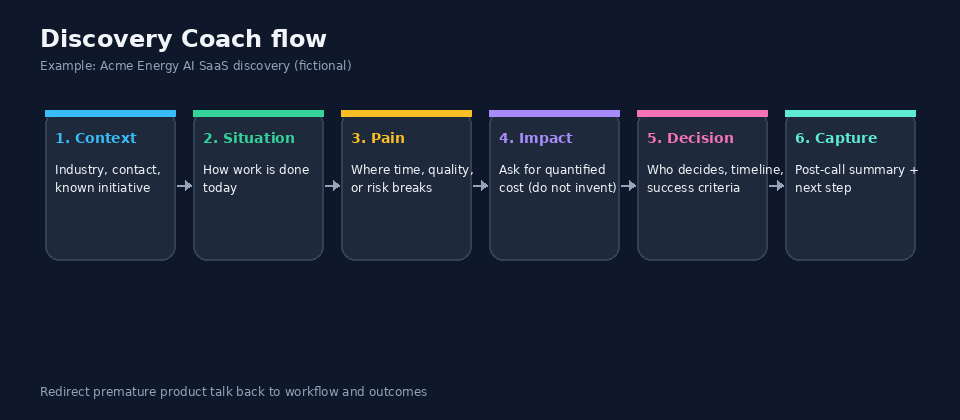
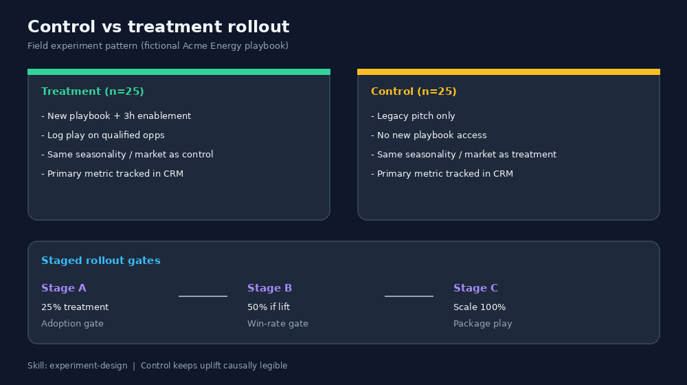
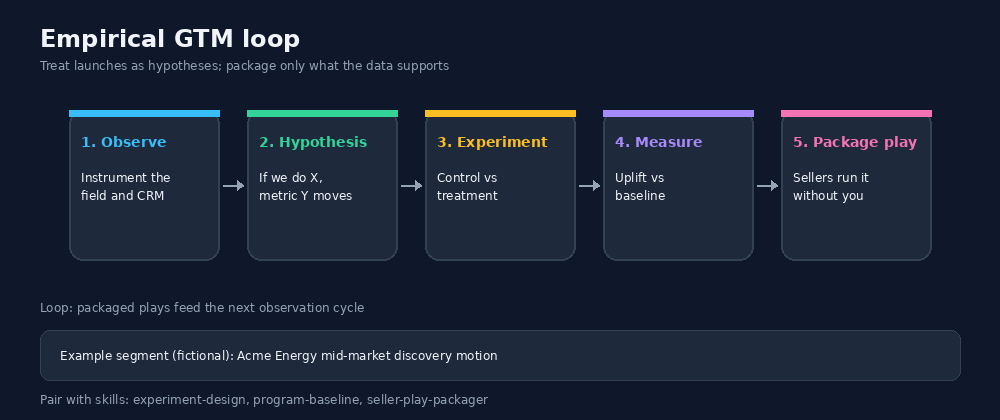

# Teaching

Materials for a 45-minute workshop aimed at business leaders: agentic AI for GTM programs.

- `workshop_01_agentic_gtm.md` - facilitator outline
- `exercises/exercise_baseline.md` - hands-on baseline exercise
- `exercises/exercise_control_group.md` - staged rollout with control group (Acme Energy, fictional)

Pair with `skills/` for reusable agent instructions and `evals/` to show how weak plans fail a rubric.

## Visual examples

*45-minute workshop agenda.*

*Discovery coach flow used as a teaching pattern.*

*Control group rollout pattern for the staged-rollout exercise.*

*Observe → hypothesis → experiment → measure → package play.*
